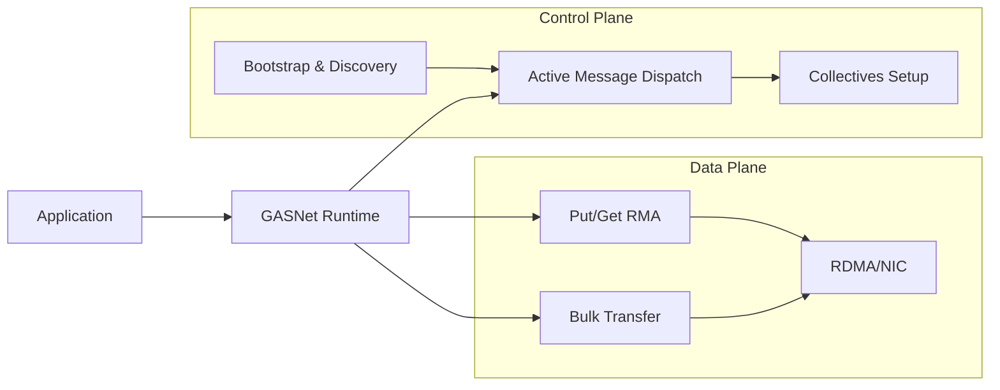

import { BreadcrumbSchema, SEOHead } from '@site/src/components/SEOHead';

<SEOHead
ogType="article"
articleSection="Architecture"
articlePublishedTime="2026-01-01"
articleModifiedTime="2026-01-16"
articleAuthor="GASNet Team"
keywords={['GASNet architecture', 'HPC architecture', 'data plane', 'control plane', 'RDMA', 'active messages', 'PGAS runtime', 'network architecture', 'InfiniBand']}
/>

<BreadcrumbSchema breadcrumbs={[
{ name: 'Home', url: '/' },
{ name: 'Docs', url: '/docs/' },
{ name: 'Architecture', url: '/docs/architecture/' },
{ name: 'Architecture Overview', url: '/docs/architecture/overview' }
]} />

A GASNet-style runtime decomposes into control and data paths that span both
software and hardware.

## Data plane

- Remote memory access (put/get) operations
- Bulk transfer pipeline (staging, zero-copy, RDMA)
- Completion queues and progress engine

## Control plane

- Endpoint discovery and bootstrap
- Active message dispatch
- Collectives setup and teardown

## Performance risk areas

- NUMA placement mismatches
- Interrupt moderation and CQ polling cadence
- Message coalescing vs. head-of-line blocking
