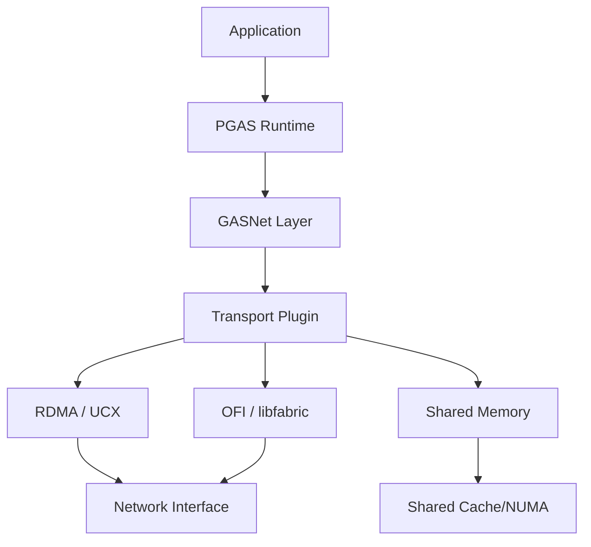

Transport layers dictate latency, throughput, and CPU involvement. Document the
trade-offs explicitly.

## Common transport families

- RDMA-based fabrics (InfiniBand, RoCE)
- Proprietary interconnects (Slingshot, Omni-Path)
- Shared-memory transports within a node

## Evaluation questions

- What is the latency floor for small messages?
- Where does bandwidth saturate?
- How much CPU time does progress require?

## Integration considerations

Map the transport capabilities to runtime features like atomics, collectives,
and active messages to avoid “fast path” surprises.
