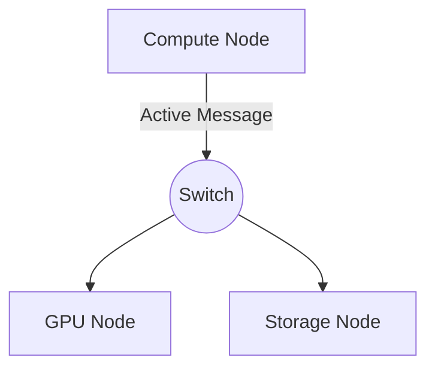

import BenchmarkChart from '@site/src/components/charts/BenchmarkChart';

This page validates every interactive feature shipped with the Gasnet.org
ultimate edition.

## 1. Topology Diagram (Mermaid)

## 2. Mathematical Models (KaTeX)

The cost of a broadcast operation in a mesh topology is:

$$T_{bcast} = (\sqrt{P} - 1) \cdot (2L + 2o + mB)$$

Where:

- $P$ is the number of processors
- $L$ is latency
- $B$ is inverse bandwidth

## 3. Interactive Benchmarks (Chart.js)

Hover over the bars to see exact microsecond latency.

  <BenchmarkChart />

## 4. Search & Comments

- **Search:** Use the top-right search box and try typing "Latency".
- **Comments:** Scroll to the bottom of this page to see the Giscus widget.
